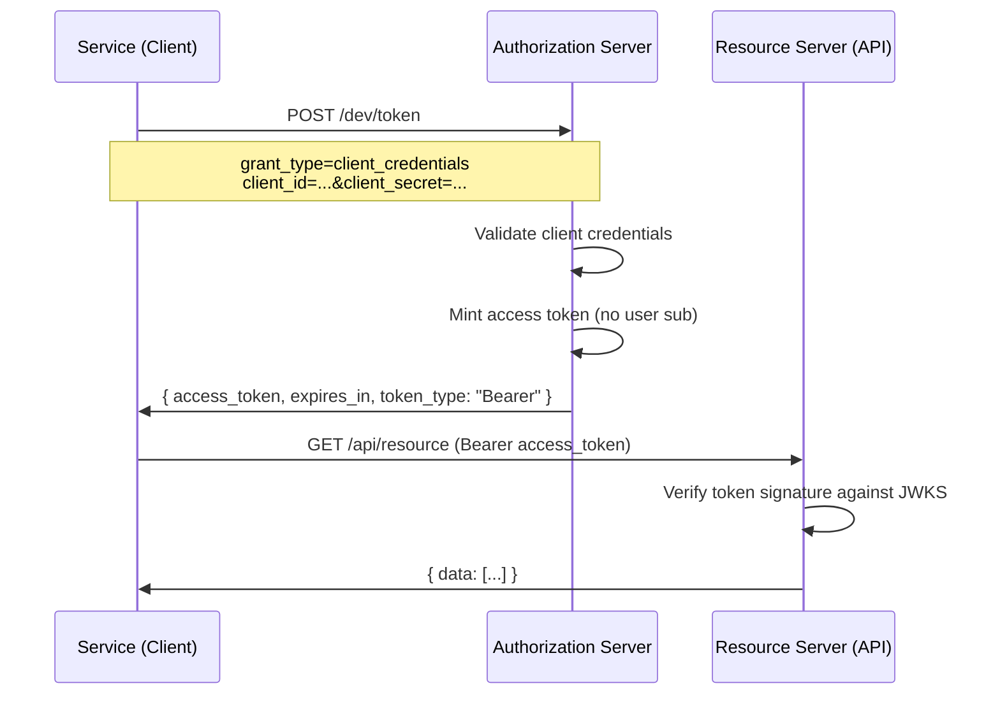

# Client Credentials (M2M)

The Client Credentials grant is for machine-to-machine authentication. No user
is involved. A service proves its own identity with a `client_id` and
`client_secret`, and gets an access token in return.

## When to use it

- Background jobs that call your API
- CI pipelines deploying or syncing data
- Service-to-service communication where no human is in the loop

## The Flow



## Token shape

The access token has no `sub` claim representing a user. Instead, the client
itself is the principal.

```json
{
  "iss": "http://localhost:9001",
  "aud": "dev",
  "client_id": "batch-worker",
  "scope": "nodes.read nodes.write",
  "iat": 1695312000,
  "exp": 1695315600
}
```

The resource server checks `client_id` and `scope` to decide what the service
can access, rather than looking up a user profile.

## How it differs from Authorization Code

| Aspect | Authorization Code | Client Credentials |
| ------ | ------------------ | ------------------ |
| User involved? | Yes | No |
| Browser redirect? | Yes | No |
| Token contains `sub`? | Yes (user identity) | No (or client identity) |
| Refresh token? | Yes | Typically no |
| Use case | User-facing apps | Services, scripts, cron |

## Key points

- No browser, no redirects, no user consent screen. One HTTP POST.
- The `client_secret` is a shared secret between the service and the IdP. Keep
  it out of client-side code, logs, and version control.
- Scope limits what the service can do. The IdP validates requested scopes
  against what the client is allowed.
- No refresh token. When the access token expires, the service requests a new
  one with the same credentials.
