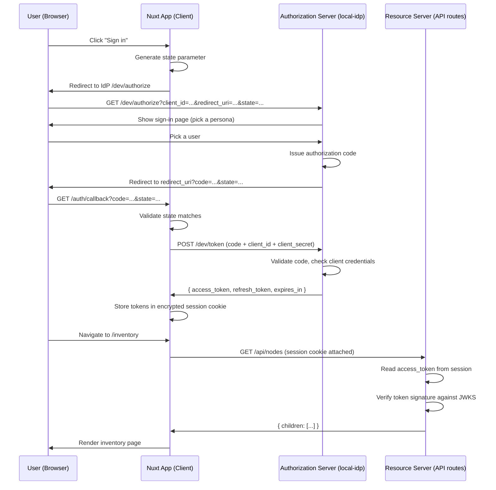
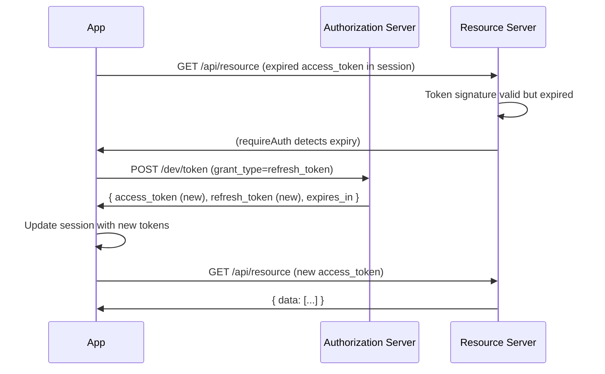

# OAuth2 Authorization Code Flow

OAuth2 handles **authorization**, granting a client (your app) access to
resources on behalf of a user, without the client ever seeing the user's
password. It says nothing about _whom_ the user is.

## Roles

| Role                     | In our stack                                        |
| ------------------------ | --------------------------------------------------- |
| **Resource Owner**       | The user (person in the browser)                    |
| **Client**               | Resource provider/app                               |
| **Authorization Server** | Possibly `local-idp` (or Google, Auth0, etc.)       |
| **Resource Server**      | API routes (`/api/<resource>`, `/api/<user>`, etc.) |

## Authorization Code Flow

The most common OAuth2 grant. The browser never touches the access token
directly as it stays server-side.



## Token Anatomy

In our setup, the access token is a signed JWT. This is a choice our IdP makes,
not something the OAuth2 spec requires. Many providers issue opaque tokens
instead (a random string that the resource server exchanges at an introspection
endpoint).

Our access token payload:

```json
{
  "iss": "http://localhost:9001",
  "aud": "dev",
  "sub": "user-bobby",
  "email": "bobby@example.com",
  "name": "Bobby Tables",
  "roles": ["admin"],
  "permissions": ["boards.write"],
  "iat": 1695312000,
  "exp": 1695315600
}
```

## Token Refresh

Access tokens _should_ expire. Rather than forcing a new login, the client uses
the refresh token to get a new access token silently.



## Key Points

- The browser never sees the access token. It lives in an encrypted server-side
  session cookie.
- The `state` parameter prevents CSRF on the callback. Without it, an attacker
  could craft a callback URL that binds your session to their account.
- The `client_secret` is sent server-to-server on the token exchange. The
  browser never has it.
- OAuth2 alone does not tell you who the user is. The `sub` claim in our access
  token is something our IdP chose to include, not something the spec
  guarantees.
