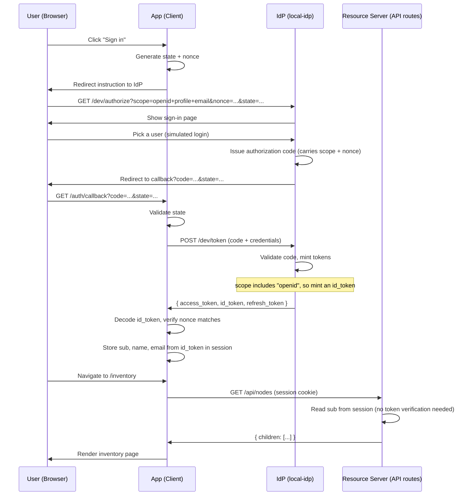
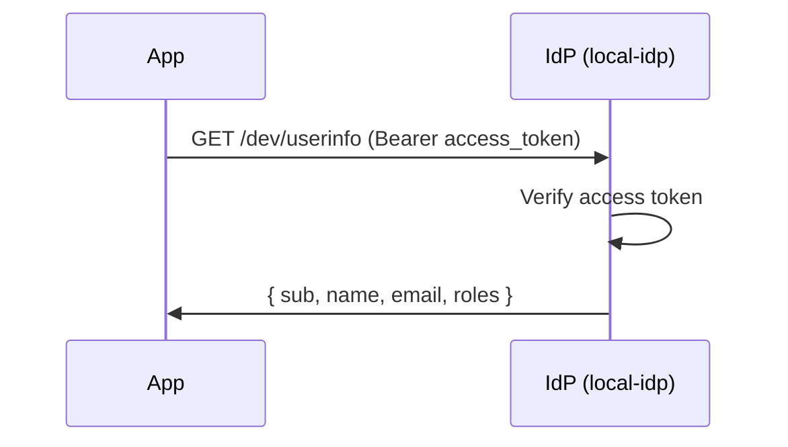
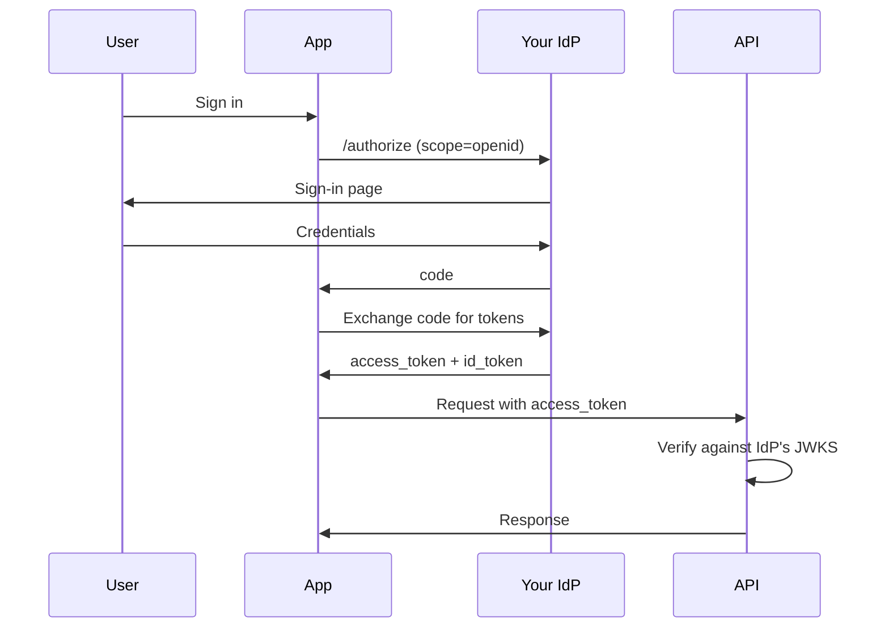
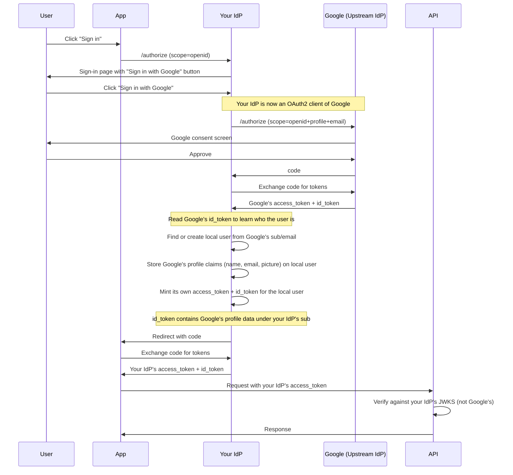

# OpenID Connect (OIDC)

OIDC is a layer on top of OAuth2 that adds **identity**. Where OAuth2 answers
"is this client allowed to access this resource?", OIDC answers "who is this
person?".

The difference is in the OIDC spec which contains an **ID Token**.

## OIDC & OAuth2

| Concept              | OAuth2   | OIDC                    |
| -------------------- | -------- | ----------------------- |
| Access token         | Yes      | Yes                     |
| ID token             | No       | Yes (new)               |
| `/userinfo` endpoint | No       | Yes (new)               |
| `scope=openid`       | No       | Required                |
| `nonce` parameter    | No       | Yes (replay protection) |
| Discovery document   | Informal | Standardized            |

## OIDC Authorization Code Flow

Example flow is a system consisting of a single page application that uses a
resource provider for data its responsible for presenting.

Same as OAuth2, but the authorization request includes `scope=openid` and a
`nonce`, and the token response includes the `id_token` field.



## The ID Token

A signed JWT from the IdP. It tells the client who authenticated, and when.

```json
{
  "iss": "http://localhost:9001",
  "aud": "dev",
  "sub": "user-jane",
  "name": "Jane Eyre",
  "email": "janeeyre@example.com",
  "nonce": "abc123",
  "at_hash": "dBjftJeZ...",
  "auth_time": 1695312000,
  "iat": 1695312000,
  "exp": 1695315600
}
```

Key fields:

- **`nonce`** -- echoed back from the authorization request. The client checks
  it matches to prevent replay attacks.
- **`at_hash`** -- hash of the access token. Binds the ID token to its companion
  access token.
- **`auth_time`** -- when the user actually authenticated. Lets the client
  decide if the authentication is fresh enough.

## Scopes

Scopes control what the ID token contains. For example:

| Scope     | Claims added to id_token |
| --------- | ------------------------ |
| `openid`  | `sub` (required minimum) |
| `profile` | `name`                   |
| `email`   | `email`                  |

Requesting `scope=openid` alone gives you only `sub`. To get the user's name and
email, include `profile` and `email`.

## The User Info Endpoint

The `/userinfo` endpoint, acts as an alternative to putting everything in the ID
token. The client sends the access token and gets claims back.



Useful when:

- The ID token is too large (complex system with many claims)
- You need claims that change between requests (real-time role checks)
- The access token is opaque, and you need to resolve it to a user

In our stack, the ID token is small and claims don't change mid-session, so the
session stores them at login time and skips `/userinfo`.

## ID Token Versus Access token

| Topic            | ID token                      | Access token                         |
| ---------------- | ----------------------------- | ------------------------------------ |
| **Audience**     | The client (your app)         | The resource server (your API)       |
| **Purpose**      | Identity: who is this person? | Authorization: can they access this? |
| **Sent to API?** | No                            | Yes                                  |
| **Format**       | Always a signed JWT           | Can be JWT or opaque                 |
| **Contains**     | sub, name, email, nonce       | sub, roles, permissions, scopes      |

The ID token is for the client to read. The access token is for the API to
validate. Sending the ID token to an API is a common mistake.

## Downstream IdP Integration (Google)

In production, `local-idp` is (hopefully 🌚) replaced by a real provider. But
sometimes the real provider itself delegates to another. For example, your IdP
offers "Sign in with Google". This creates a chain.

### Direct IdP



### Federated Login (Delegation)

For example, your IdP may delegate to Google, GitHub, Auth0, so on, for sign-in.

Your IdP becomes an intermediary in this case. It is an OIDC client of Google,
**and** an OIDC provider to your app. The app has no need to request data from
Google directly.



Key points about federation:

- **Your app only talks to your IdP.** It never talks to Google. If you switch
  from Google to GitHub login, no client code changes.
- **Two token sets exist.** Google's tokens live inside your IdP. Your app's
  tokens come from your IdP. The API only sees your IdP's tokens.
- **Your IdP maps identities.** It reads Google's `sub` claim and maps it to a
  local user record. The `sub` in your IdP's tokens is yours, not Google's.
- **Your JWKS is what the API checks.** Token verification never touches
  Google's keys. Your IdP signed the token, your IdP's keys verify it.

## How - Stack Implementation

| Component          | Role                       | What it does                                                     |
| ------------------ | -------------------------- | ---------------------------------------------------------------- |
| `local-idp`        | Authorization Server / IdP | Issues codes, mints access + ID tokens, serves JWKS, `/userinfo` |
| **API routes**     | Resource Server            | Reads `sub` from session, loads profile, returns data            |
| **Session cookie** | Token transport            | Encrypted cookie holds access_token + identity claims            |
