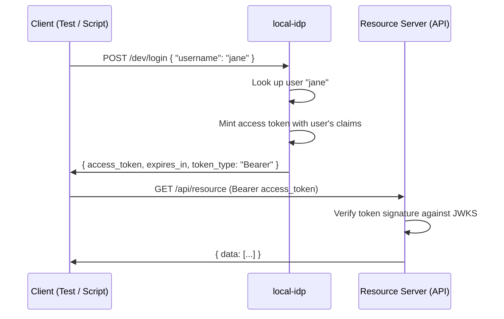

# Simple Login

Simple Login bypasses OAuth2 entirely. A client makes a `POST` with a username
and gets an access token back. No redirects, no authorization codes, no browser.

Note however that this is not a standard OAuth2 grant. It exists for convenience
during local development and testing.

## When to use it

- Integration tests that need a valid token without running a browser
- Local development where the redirect dance adds friction
- Seeding scripts that need to act as a specific user

## The Flow



## Why it exists

The Authorization Code flow requires a browser, redirects, and user interaction.
For automated tests and scripts, that overhead is unnecessary. The test already
knows which user it wants to act as.

Simple Login trades security for speed. There is no password, no consent, no
proof that the caller is the user. Anyone who can reach the endpoint can get a
token for any user. This is fine for local development. It is not fine for
production.

## Token shape

The token is identical to one issued by the Authorization Code flow. The
resource server can't tell the difference.

```json
{
  "iss": "http://localhost:9001",
  "aud": "dev",
  "sub": "user-jane",
  "name": "Jane Eyre",
  "email": "janeeyre@example.com",
  "roles": ["admin"],
  "iat": 1695312000,
  "exp": 1695315600
}
```

## How it differs from other grants

| Aspect            | Auth Code         | Client Credentials  | Simple Login     |
| ----------------- | ----------------- | ------------------- | ---------------- |
| User involved?    | Yes (browser)     | No                  | Yes (by name)    |
| Authentication?   | Yes (IdP sign-in) | Yes (client secret) | No               |
| Browser required? | Yes               | No                  | No               |
| Output            | User-scoped JWT   | Client-scoped JWT   | User-scoped JWT  |
| Security          | Production-grade  | Production-grade    | Development only |

## Key points

- This endpoint is only mounted when `IDP_MODE_SIMPLE=true`.
- No `client_secret` or password is required. The username alone is enough.
- The token is signed with the same key as all other tokens. JWKS verification
  works the same way.
- Do not expose this endpoint outside of local development.
