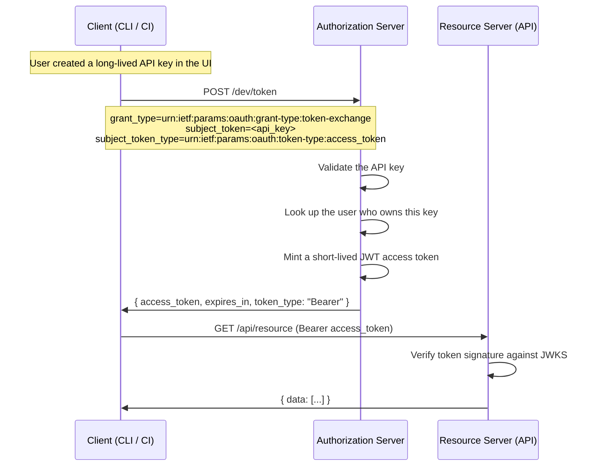

# Token Exchange (RFC 8693)

Token Exchange lets a client swap one token for another. The most common use is
a long-lived API key is exchanged for a short-lived JWT access token.

Reference: <https://www.rfc-editor.org/rfc/rfc8693.html>

## When Its Used

- CLI tools where a user configured an API key, but the runtime is headless
- CI pipelines that store a static API token as a secret
- Delegating access across trust boundaries (service A passes its token to
  service B, which exchanges it for a token scoped to service B's audience)

## The Flow



## Contrast With Direct API Keys

API keys are long-lived secrets. If one leaks, it's valid until someone revokes
it. Short-lived JWTs limit the blast radius as a leaked JWT expires in hours
rather than the predetermined TTL of the key.

| Aspect              | API key                  | Exchanged JWT              |
| ------------------- | ------------------------ | -------------------------- |
| Lifetime            | Months or indefinite     | Hours                      |
| Revocation          | Manual                   | Automatic (expiry)         |
| Verifiable offline? | No (must hit a database) | Yes (JWKS signature check) |
| Carries claims?     | No                       | Yes (sub, scope, etc.)     |

The API key is a credential. The JWT is a proof. Exchange turns one into the
other.

## Token Shape

The exchanged JWT looks like any other access token. The `sub` is the user who
owns the API key.

```json
{
  "iss": "http://localhost:9001",
  "aud": "dev",
  "sub": "user-jane",
  "scope": "nodes.read nodes.write",
  "iat": 1695312000,
  "exp": 1695315600
}
```

## Comparison To Other Grants

| Aspect            | Auth Code                 | Client Credentials | Token Exchange           |
| ----------------- | ------------------------- | ------------------ | ------------------------ |
| User involved?    | Yes (browser)             | No                 | Yes (indirect)           |
| Browser redirect? | Yes                       | No                 | No                       |
| Input credential  | User's password (via IdP) | client_id + secret | Existing token / API key |
| Output            | User-scoped JWT           | Client-scoped JWT  | User-scoped JWT          |
| Use case          | Web apps                  | Services           | CLI, CI, delegation      |

## Key points

- Token Exchange is a grant type on the same `/dev/token` endpoint. The
  `grant_type` value distinguishes it from authorization code or client
  credentials.
- The input token (`subject_token`) can be any token type the IdP understands:
  an API key, an access token from another IdP, or a SAML assertion.
- The output token is scoped and short-lived. The IdP controls what claims and
  permissions the exchanged token carries.
- RFC 8693 also defines `actor_token` for delegation chains (service A acts on
  behalf of user X). This is optional and not needed for the API-key-upgrade
  pattern.
